**Restaurant Management System**
A full-stack web application designed to simplify and automate restaurant operations by managing menus, orders, kitchen workflows, reservations, and customer reviews from a single platform. The system provides real-time updates and role-based dashboards to ensure smooth coordination between admin, kitchen staff, and customers.

**Features**
User authentication and role-based access (Admin, Kitchen, Staff)
Menu management (add, update, delete food items)
Order management with real-time status updates
Kitchen Order Ticket (KOT) workflow
Reservations management
Customer reviews and ratings
Dashboard with order and revenue insights
Responsive and modern UI

**Tech Stack & Tools Used**
Frontend
Next.js
React
TypeScript
Tailwind CSS
shadcn/ui
Framer Motion

**Backend**
Node.js
REST APIs
Prisma ORM
**Database**
MongoDB
**Tools & DevOps**
Git & GitHub
Postman(Thunder Clinet)

## 📸 Application Screenshots

### 🔐 Authentication
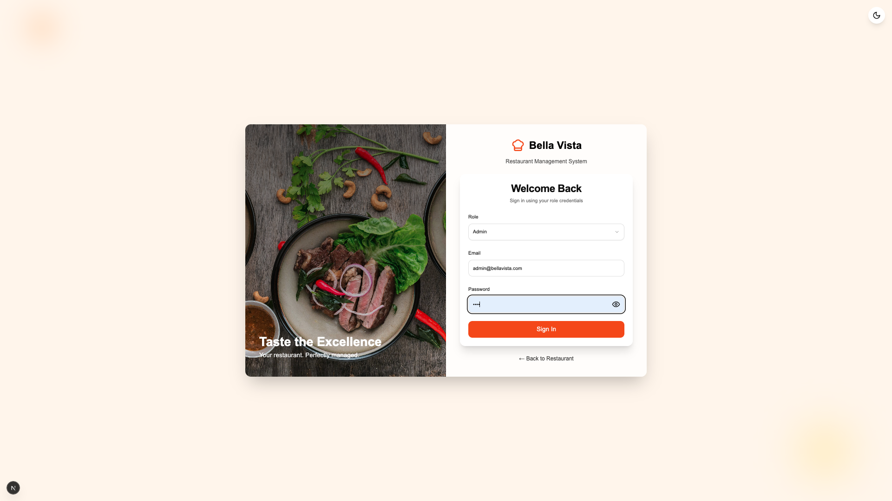

---

### 📊 Dashboard
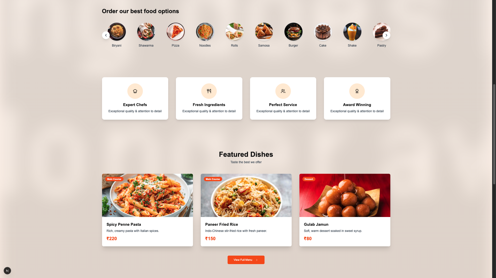
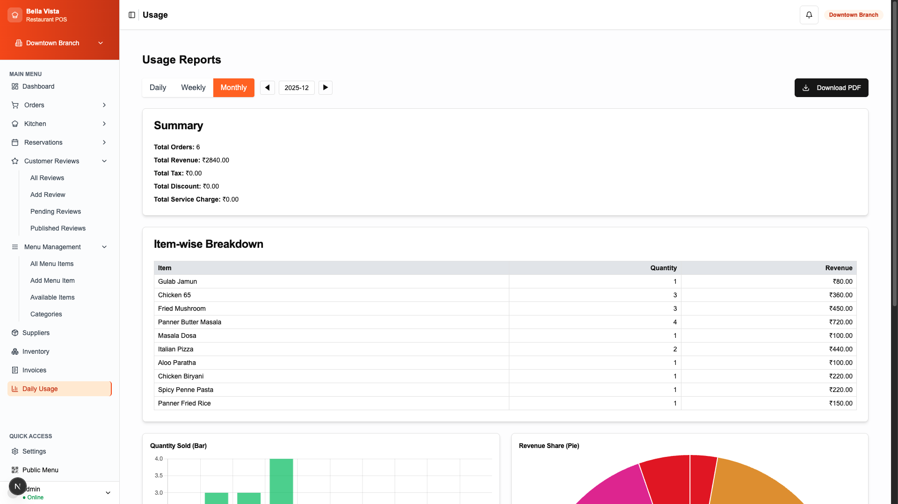

---

### 🍽️ Menu Management
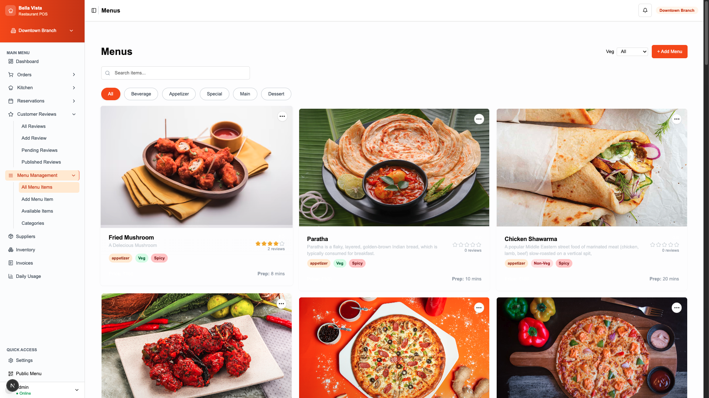
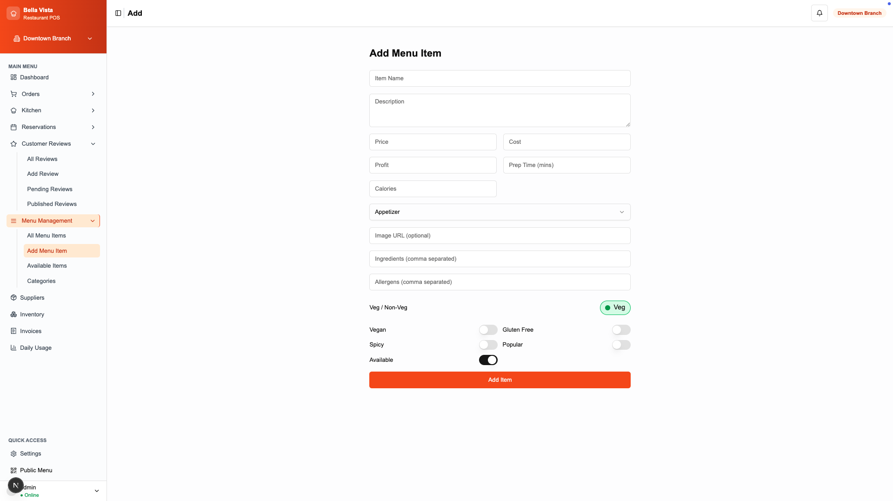
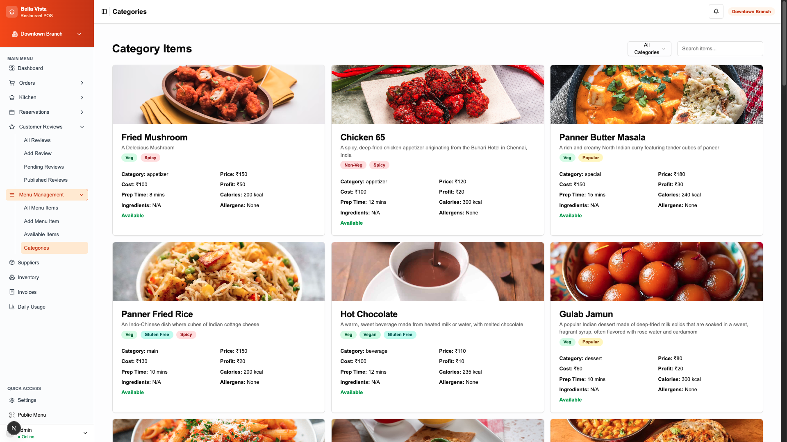

---

### 👨‍🍳 Staff & Admin
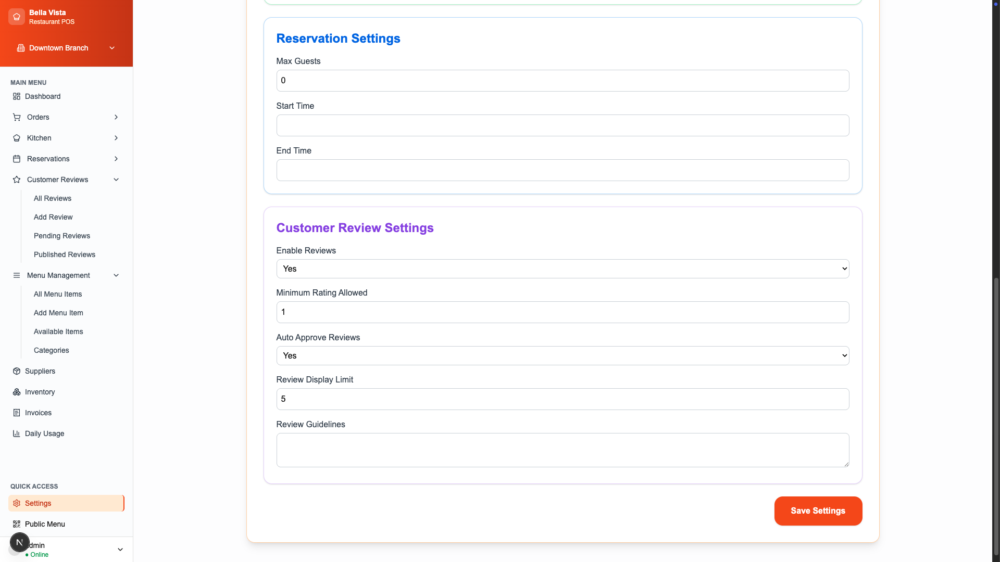
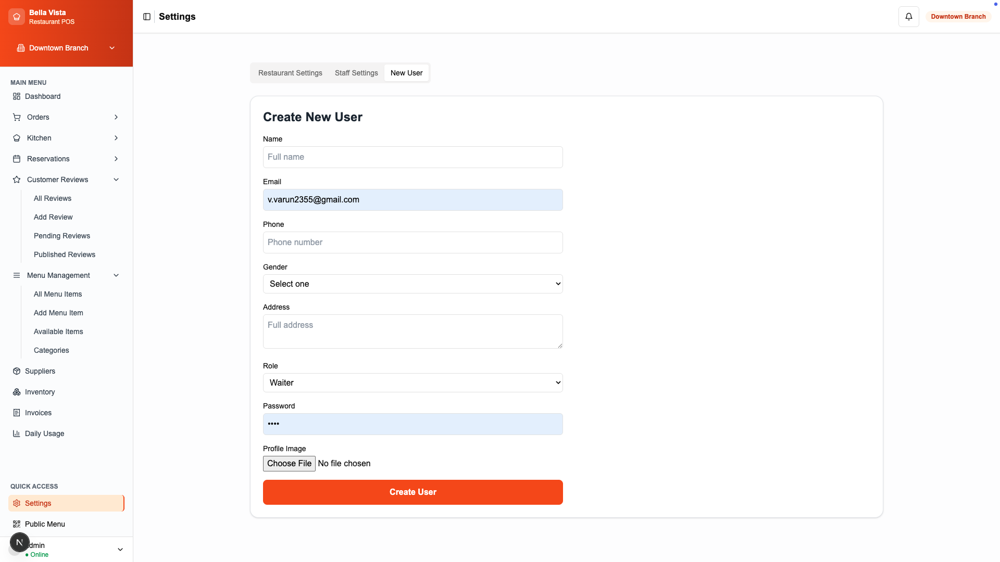
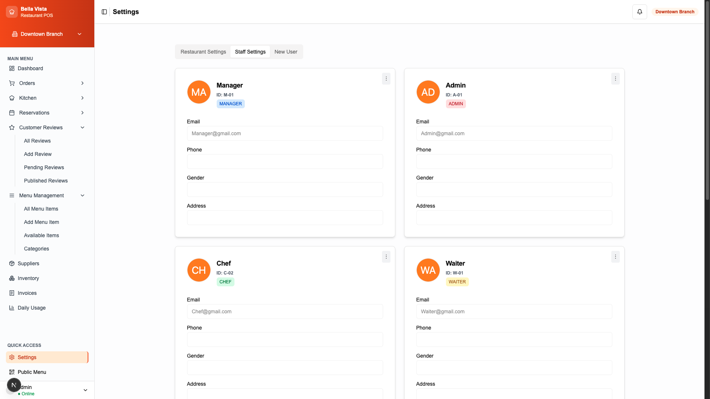

---

### 🧾 Orders & Invoices
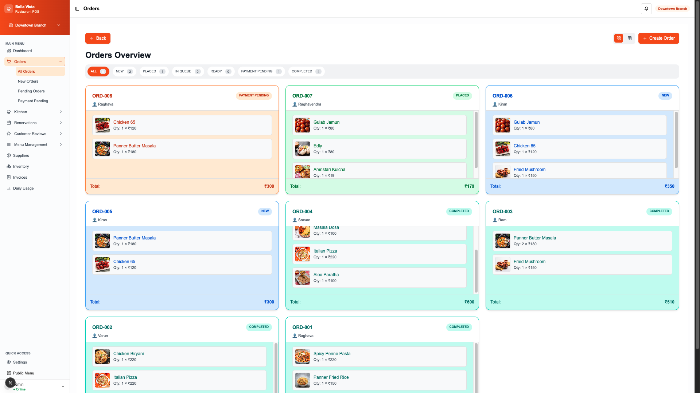

---

### 📅 Reservations

---

### 🍳 Kitchen

---

### 📦 Inventory
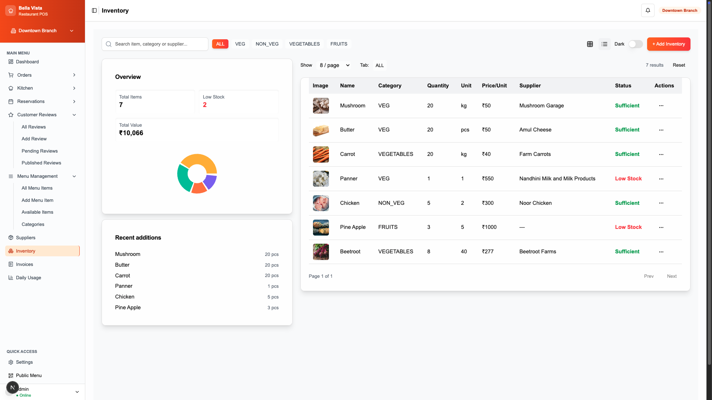

